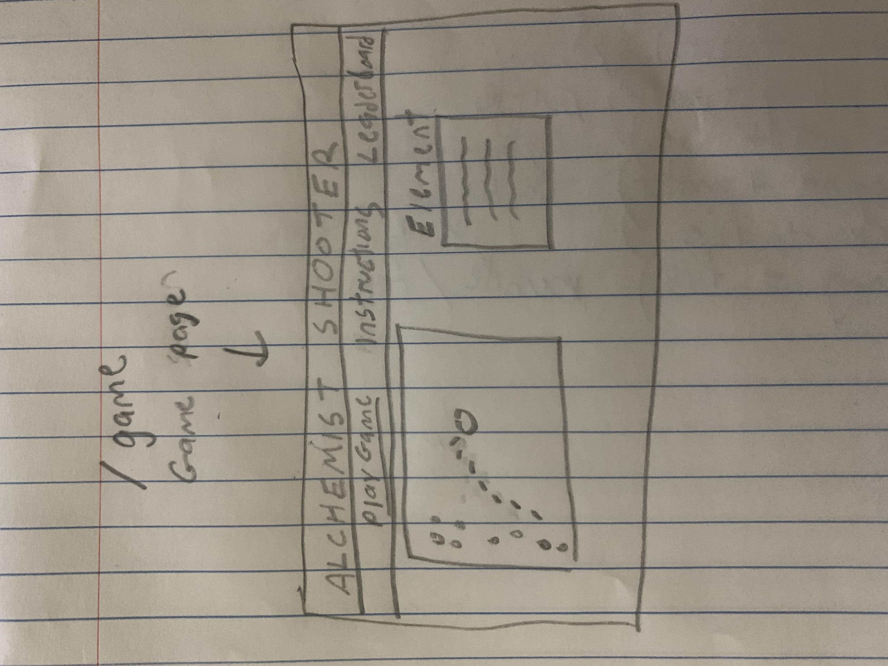
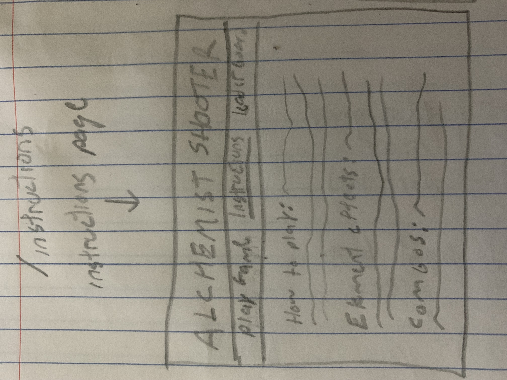
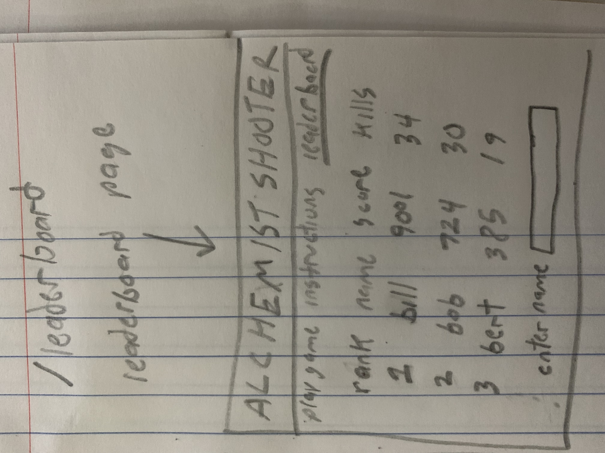

# Alchemist Shooter

## Overview

For my project I'll be making a game in which the player controls an alchemist, represented by a dot on the screen, who must avoid enemies(also dots) moving towards them(similar to agari.o but only one player). The player can shoot these objects with spells(smaller dots) to destroy them and their score is determined by how many enemies they destroy and how long they lasted before getting hit by an enemy. The game will also have power ups based on the 4 elements earth, fire, wind, and air, each with different effects. These elements can be combined to create even more power ups(water + air = ice, fire + earth = magma, etc). The power ups along with their combos and effects(represented as functions) will be stored in a database. In addition to the game I’ll also implement a leaderboard where players can enter their name at the end of a game so that their name and score is stored in a database and displayed.


## Data Model


The application will store store players, the elements they have available to them, and their stats(player time, high score, enemies killed, etc)

* There will be a static database defining element interactions


An Example User:

```javascript
{
  playername: "player1",
  stats: [
    highscore: 9001,
    playertime: 240,
    kills: 19
  ],
  elements: // an array of elements they've collected
}
```

Static elements database

```javascript
{
  fire: [
    { damage: 10, firerate: 10 }
    { combos: [
      {water: 'steam', damage: 1, firerate:  8}
      {earth: 'magma', damage: 12, firerate: 3}
      {air: 'smoke', damage: 6, firerate: 8}
    ]}
  ]
  
  water: [
    { damage: 5, firerate: 4 }
    { combos: [
      {fire: 'steam', damage: 1, firerate:  8}
      {earth: 'plant', damage: 4, firerate: 3}
      {air: 'ice', damage: 11, firerate: 5}
    ]}
  ]
  
  earth: [
    { damage: 15, firerate: 1 }
    { combos: [
      {fire: 'magma', damage: 12, firerate: 3}
      {water: 'plant', damage: 4, firerate: 3}
      {air: 'sand', damage: 6, firerate: 9}
    ]}
  ]
  
  air: [
    { damage: 2, firerate: 20 }
    { combos: [
      {fire: 'smoke', damage:6, firerate: 8}
      {water: 'ice', damage: 11, firerate: 5}
      {earth: 'sand', damage: 6, firerate: 9}
    ]}
  ]
```


## [Link to Commented First Draft Schema](db.js) 

(__TODO__: create a first draft of your Schemas in db.js and link to it_)

## Wireframes

/game - page for creating a new shopping list



/instructions - page for showing all shopping lists



/leaderboard - page for showing specific shopping list



## Site map

#### /game
- links to /instructions and /leaderboard

#### /instructions
- links to /game and /leaderboard

#### /leaderboard
- links to /game and /instructions


## User Stories or Use Cases

(__TODO__: write out how your application will be used through [user stories](http://en.wikipedia.org/wiki/User_story#Format) and / or [use cases](https://www.mongodb.com/download-center?jmp=docs&_ga=1.47552679.1838903181.1489282706#previous)_)

1. as non-registered user, I can register a new account with the site
2. as a user, I can log in to the site
3. as a user, I can create a new grocery list
4. as a user, I can view all of the grocery lists I've created in a single list
5. as a user, I can add items to an existing grocery list
6. as a user, I can cross off items in an existing grocery list

## Research Topics

(__TODO__: the research topics that you're planning on working on along with their point values... and the total points of research topics listed_)

* (5 points) Integrate user authentication
    * I'm going to be using passport for user authentication
    * And account has been made for testing; I'll email you the password
    * see <code>cs.nyu.edu/~jversoza/ait-final/register</code> for register page
    * see <code>cs.nyu.edu/~jversoza/ait-final/login</code> for login page
* (4 points) Perform client side form validation using a JavaScript library
    * see <code>cs.nyu.edu/~jversoza/ait-final/my-form</code>
    * if you put in a number that's greater than 5, an error message will appear in the dom
* (5 points) vue.js
    * used vue.js as the frontend framework; it's a challenging library to learn, so I've assigned it 5 points

10 points total out of 8 required points (___TODO__: addtional points will __not__ count for extra credit_)


## [Link to Initial Main Project File](app.js) 

(__TODO__: create a skeleton Express application with a package.json, app.js, views folder, etc. ... and link to your initial app.js_)

## Annotations / References Used

(__TODO__: list any tutorials/references/etc. that you've based your code off of_)

1. [passport.js authentication docs](http://passportjs.org/docs) - (add link to source code that was based on this)
2. [tutorial on vue.js](https://vuejs.org/v2/guide/) - (add link to source code that was based on this)

